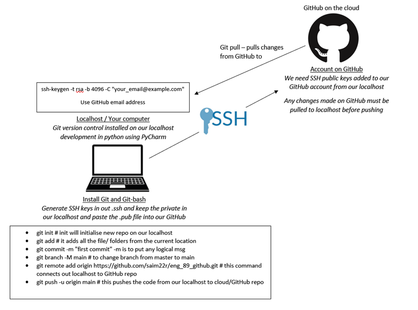

# Starting Up with Git and Git Bash


## This is a simple guide to get you started up using git.


- Firstly `Git` must be installed via this [Download Link](https://git-scm.com/downloads). Choose the correct operating system to run on your local machine.


### Open Git Bash Terminal

- Open Git Bash (run as administrator if windows)

###  Creating an SSH Directory and Generating Public/Private RSA Key Pair
- Create an SSH directory by typing `mkdir .ssh` in Git Bash Terminal.
- Enter the directory by typing ` cd ~/.ssh` in Git Bash Terminal.


- Generate the public/private rsa key pair `ssh-keygen -t rsa -b 4096 -C "your_email@example.com"`
  - run `ls` to list all the files and directories within current directory. The following below should be seen.

```
id_rsa            id_rsa.pub 
```    


- Type `cat id_rsa.pub` then copy content.
- Go to Github Online then go to Settings --> SSH and GPG keys --> New SSH Key
- Paste the SSH Key and save.


**The SSH connection between the localhost and github has now been established and you are ready to begin version control of software.**




